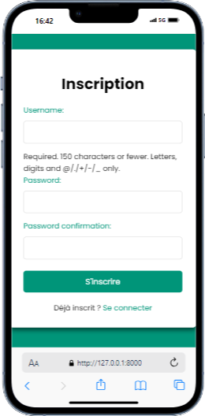
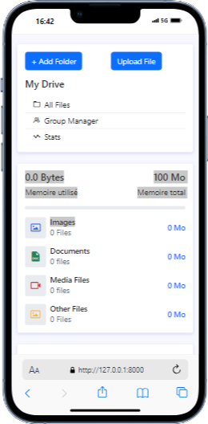
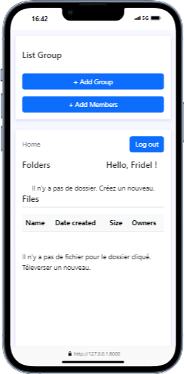
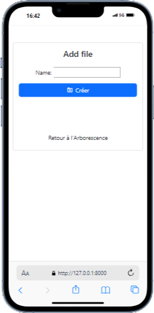

# Google Drive Manager Clone

Un clone de Google Drive Manager développé en Django, HTML et JavaScript. Ce projet vise à fournir une interface pour gérer des fichiers et des dossiers, similaire à Google Drive.

## Table des matières

- [Technologies utilisées](#technologies-utilisées)
- [Arborescence du projet](#Arborescence-du-projet)
- [Installation](#installation)
- [ScreenShot](#ScreenShot)


## Technologies utilisées

- *Django == [5.1.2]* - Framework web Python
- *SQLite* - Base de données
- *HTML/CSS/BootStrap* - Frontend
- *JavaScript* - Interactions dynamiques


# Arborescence du projet

```
Cloud/
    cloud_projet/
        auth_app/
            __init__.py
            __pycache__/
            admin.py
            apps.py
            form.py
            migrations/
            models.py
            tests.py
            urls.py
            views.py
        cloud_projet/
            __init__.py
            __pycache__/
            asgi.py
            settings.py
            urls.py
            wsgi.py
        cloudProjet.sqlite3
        home_app/
            __init__.py
            __pycache__/
            admin.py
            apps.py
            form.py
            migrations/
            ...
        manage.py
        static/
        templates/
    venv/
        Include/
        Lib/
        pyvenv.cfg
        Scripts/
pictures/
README.md
requirements.txt
setup.sh
```

## Installation

1. *Cloner le dépôt :*

   ```bash
   git clone https://github.com/Mael8zinsou/Cloud-File-manager-Django.git
   cd Cloud-File-manager-Django ou cd Cloud-File-manager-Django-main
    ```

2. *Créer un environnement virtuel :*
   
    Sur macOS/Linux :
    ```bash
    python -m venv venv
    source venv/bin/activate
    ```
    Sur Windows : 
    ```bash
    python -m venv venv
    venv\Scripts\activate
    ```

3.  Installer les dépendances :
    ```bash
    pip install django
    ```

4.  Se déplacer dans le projet :
    ```bash
    cd cloud_projet
    ```

5. *Effectuer les migrations :*
 Avant de lancer le projet, exécutez les migrations pour configurer la base de données :
    ```bash
    python manage.py makemigrations
    python manage.py migrate
    ```
6. *Lancer le projet :*
  Pour démarrer le serveur de développement :
    ```bash
    python manage.py runserver
    ```
 Le projet sera accessible à l'adresse http://127.0.0.1:8000/.
    

## ScreenShot

* Inscription Interface



* Connexion Interface


* Interface1



* Interface2



* Add_file Interface




## <span style="color:green">Points Importants</span>

- On ne peut pas copier un dossier que si il n'est pas vide. ( Donc créer 2 dossiers qui ont le même parent avant de copier l'un dans l'autre tout en s'assurant que le dossier n'est pas vide )
- Les types de fichiers pouvant être visualisés sont les suivants : `.png`, `.jpg`, `.jpeg`,
    `.gif`, `.bmp`, `.txt`,
    `.pdf`, `.html`, `.htm`,
    `.mp4`, `.avi`, `.wmv`, `.flv`, `.webm`. Le reste ne sera pas visualisé. 
- Les données binaire des fichiers upload sont enregistrés dans la base de données et non en local.
- N'oubliez pas votre connexion Internet.
